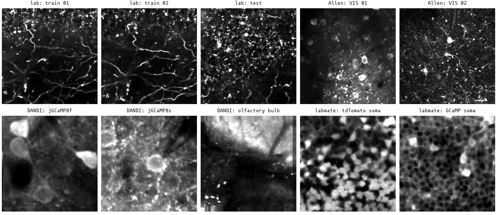

# registration benchmark

This is the working record for the motion-correction comparisons. The expanded benchmark uses the ten reference images under `benchmarking/sources/`, four synthetic movement recipes, a seed derived from `42`, and a fixed first-half boundary at observation 1000. The second half remains held out when the displacement error is scored.

The two `lab-session-1` references are central 256 × 256 crops of the supplied PNGs.
The FibreSight rows, source-group summaries, figures, and review movies below
were regenerated from those public arrays on 3 September 2026. The benchmark
suite was rerun after the crop change; 19 external runs exited non-zero and
remain recorded in the resource table.

## methods

The completed comparison now includes:

- FibreSight rigid, from the current checkout;
- FibreSight piecewise, from the current checkout;
- Suite2p rigid, version 0.11.1;
- Suite2p piecewise, version 0.11.1;
- CaImAn rigid (NoRMCorre), version 1.12.2;
- CaImAn piecewise (NoRMCorre), version 1.12.2;
- PatchWarp rigid, version 1.3.3;
- PatchWarp affine, version 1.3.3;
- PyFlowReg piecewise, version 0.1.0a9.

FibreSight rigid uses `whitening=0` in the base comparison. The original photon sweep adds `FibreSight w=0.5` and `FibreSight w=1`; the later piecewise pass uses the frozen 80-pixel tile and spline settings described below.

The external sources are kept under `workspace/dev/sources/`, which is ignored with the generated benchmark data. The source anchors recorded for the scored methods are:

```text
FibreSight v0.2.0      current checkout (dirty worktree)
PatchWarp v1.3.3       7cac6307b6d3aa107baecd86d8085823b437fbb1
PyFlowReg v0.1.0a9     126d1996c24b330bec20e7268937f9122fd2f4ab
```

PyFlowReg is still marked alpha upstream, so its rows are labelled `PyFlowReg`, without claiming equivalence to the MATLAB implementation. PatchWarp uses the local MATLAB R2022b installation with Parallel Computing Toolbox and Image Processing Toolbox. Its rigid and affine runs use four single-threaded workers; the supplied first-half reference lets the native one-TIFF path retain its 50-frame affine estimates.

The MATLAB helper files that PatchWarp calls directly are kept under `benchmarking/matlab/`; `nanmean.m` and `nanmedian.m` supply the reductions that PatchWarp v1.3.3 expects from the older Statistics Toolbox API. They are small compatibility files, not generated output.

The public synthetic benchmark needs the ten `.npy` images under `benchmarking/sources/`. A same-stem PNG sits beside each array for inspection; `benchmarking/sources/PUBLIC_SOURCES.md` records the Allen, DANDI, FibreSight, and Zhuoyang Ye provenance. TIFF recordings, generated movies, external checkouts, and Python environments stay under the ignored `workspace/` directory. The local real-recording checks below are optional diagnostics and do not enter the synthetic figures or summary tables.



The FibreSight and external rows were produced with the pinned environments
below. The local interpreter launches `benchmarking.registration_benchmark_suite`:

- FibreSight 0.2.0 under the Python interpreter that launches `benchmarking.registration_benchmark_suite`;
- Suite2p 0.11.1 under Python 3.10.20 at `workspace/dev/envs/suite2p-0.11.1/bin/python`;
- CaImAn 1.12.2 under Python 3.10.20 at `workspace/dev/envs/caiman-1.12.2/bin/python`;
- PyFlowReg 0.1.0a9 under Python 3.11.15 at `workspace/dev/envs/pyflowreg-0.1.0a9/bin/python`;
- MATLAB 9.13.0.2698988 (R2022b Update 10) at `/Applications/MATLAB_R2022b.app/bin/matlab`, with Image Processing Toolbox 11.6 and Parallel Computing Toolbox 7.7;
- the Apple command-line tools under `/Library/Developer/CommandLineTools`. `xcode-select --install` reports that they are installed.

## benchmark matrix

The expanded base suite has 40 movies: ten saved reference images crossed with `ordinary_motion`, `large_motion`, `local_deformation`, and `focal_change`. Each movie has 2000 observations, 65 control-channel photons, and 18% total bleaching. FibreSight rigid and piecewise runs completed all 40 cases. The external outputs cover 40 Suite2p rigid cases, 40 Suite2p piecewise cases, 40 CaImAn rigid cases, 28 CaImAn piecewise cases, 40 PatchWarp rigid cases, 33 PatchWarp affine cases, and 40 PyFlowReg piecewise cases. The 19 failed external runs remain in `resources.csv` with non-zero exit codes.

The intensity suite has 42 distinct movies and 408 method runs:

- the photon sweep has three images, four motion recipes, photon counts of 30, 65, and 150, and fixed 20% bleaching: 36 movies, each run with all ten photon-sweep methods, giving 360 runs;
- the bleaching sweep has three images, `ordinary_motion`, 65 photons, and total bleaching of 0%, 20%, and 50%. The three 20% movies already exist in the photon sweep, so the 0% and 50% conditions add six movies and 48 runs with the eight base methods.

The same source and motion recipe use the same seed across photon or bleaching levels. This isolates the intensity change from the displacement truth; seeds are derived from `42`.

## expanded base results

The held-out 95th-percentile displacement errors are below. Each mean first averages the four recipe values within a source image, then averages the complete source means. The rows use the runs recorded above; incomplete external methods contribute only their complete source means.

| Method | Cases | Complete sources | Mean p95 error (px) |
|---|---:|---:|---:|
| FibreSight rigid | 40 | 10 | 0.442757 |
| FibreSight piecewise | 40 | 10 | 0.514340 |
| Suite2p rigid | 40 | 10 | 0.793597 |
| Suite2p piecewise | 40 | 10 | 1.267313 |
| CaImAn rigid | 40 | 10 | 0.464851 |
| CaImAn piecewise | 28 | 7 | 1.618834 |
| PatchWarp rigid | 40 | 10 | 0.458152 |
| PatchWarp affine | 33 | 7 | 1.887478 |
| PyFlowReg piecewise | 40 | 10 | 2.471898 |

The missing external values are treated as absent scores. Means and intervals use complete source means, so a source contributes only when all four recipes completed for that method. The resource table remains the record of failures; they are not converted into large finite errors.

The rigid comparisons fit one constant reference offset on observations 0 to 999 and score observations 1000 to 1999. Positive advantage means that the competitor has a larger error than FibreSight:

| Rigid competitor | Competitor mean p95 (px) | Advantage (px) | 95% t interval |
|---|---:|---:|---:|
| Suite2p | 0.793597 | 0.350840 | 0.323459 to 0.378222 |
| CaImAn | 0.464851 | 0.022093 | -0.034217 to 0.078404 |
| PatchWarp | 0.458152 | 0.015395 | -0.008897 to 0.039687 |

The Suite2p source-level interval is positive; the CaImAn and PatchWarp intervals cross zero. The case-level Wilcoxon test resolves FibreSight against Suite2p after Bonferroni correction, but not against CaImAn or PatchWarp; the ten source anatomies remain the relevant unit for an anatomical generalisation.

## piecewise results

FibreSight first estimates an 80-pixel overlapping tile grid around its rigid position. Each retained 7 by 7 correlation surface supplies a two-dimensional precision matrix; PIV normalised-median validation removes inconsistent vectors. A confidence-weighted cubic B-spline then separates one unpenalised global adjustment from the local field. Calibration observations 0 to 999 froze the spatial penalty at 10 and the coefficient-magnitude penalty at 1. No temporal smoothing enters the field.

The applied field must retain at least 60% of tiles, stay within 3 px of the rigid correction, keep neighbouring tile predictions within 3 px, and keep the sampling-map Jacobian inside 0.80 to 1.25. Rejected frames use the rigid correction and retain a named reason. Across the expanded suite, 2,294 of 80,000 frames use this fallback. The largest source total is 1,748 frames for Allen VIS 01, followed by 286 for Allen VIS 02; this is part of the measured behaviour, since the field safeguards are active much more often on some anatomies.

The two 256-pixel `lab-session-1` sources also exercised the reference fallback in all eight cases. The relaxed pass supplied 992 to 1,000 aligned candidates, from which 500 time-balanced frames were accepted. Five hundred remains the stable target; it is no longer a hard processing threshold when only 50 to 499 usable frames remain. Fewer than 50 usable frames still stops reference construction.

Pooled held-out confidence rejects 96.25% of raw tile errors above 1 px and 2.49% of clean tiles, passing the declared 95% detection and 5% clean-rejection limits. Every held-out non-rigid cell passes the 0.20 px median and 0.50 px p95 endpoint gates. Seven of nine deformation-free cells pass the 0.10 px median and 0.25 px local p95 gates; the other two p95 values are 0.256 and 0.251 px.

On the common 7 by 7 grid, FibreSight's mean held-out p95 error is 0.514340 px across ten complete sources, compared with 1.267313 for Suite2p piecewise and 2.471898 for PyFlowReg. FibreSight's source-level advantage over Suite2p is 0.752972 px (95% t interval 0.096080 to 1.409865); the lower bound is positive. The 40-case Wilcoxon p-value is 2.00e-10 before correction and 8.00e-10 after correction for four piecewise comparisons.


CaImAn piecewise and PatchWarp affine failed enough public cases that their comparisons use seven sources; PyFlowReg completed all ten. FibreSight's advantage is 1.079743 px against CaImAn (95% interval 0.388864 to 1.770621; 28 paired cases), 1.450300 px against PatchWarp (0.091497 to 2.809102; 33 paired cases), and 1.957558 px against PyFlowReg (0.539682 to 3.375434; 40 paired cases). These intervals describe the cases each method could estimate; the separate failure counts remain part of the result.

Automatic model selection compares calibration-half gradient NCC, spatially cross-validated tile-residual p95, valid area, measured signal/control residual alignment, and accepted-or-named-fallback coverage. Four interleaved tile folds fit on three spatial classes and score the fourth. Synthetic truth is opened afterwards, solely to score the choice. On the 40-case suite, whose saved movies contain only the control channel, `auto` selects piecewise registration for three cases and rigid registration for 37; its mean held-out p95 error is 0.391587 px.

The independent validation uses a separate seed branch, 1,000 frames per case, and newly generated signal and control movies for the original three references and four motion recipes. `auto` selects piecewise registration in two of 12 cases, with both choices improving on rigid; the other ten cases retain rigid. Its mean held-out p95 error is 0.316378 px, compared with 0.435837 px for rigid, 0.245210 px for forced piecewise, and 0.192131 px for the lower-error model chosen afterwards from truth. The selector misses four piecewise gains, three during focal-change recipes and one during local deformation, because their gradient-NCC gains remain below the frozen 0.01 boundary. The largest missed gain is 0.586877 px. Every case supplies focus evidence, and the measured cross-channel residual passes every comparison. The generated channels share one static coordinate system; the coordinate direction for a non-zero signal/control offset is tested separately in `test_preprocessing.py`. I have kept the 0.01 boundary unchanged after this held-out inspection. `auto` therefore remains the planned default: this validation found no harmful escalation beyond rigid, although its conservative boundary leaves measurable piecewise improvement unused.

Across the expanded suite, FibreSight's rigid and field subprocesses have a median combined wall time of 70.787 s. Maximum process RSS is 0.733 GiB for rigid registration and 0.493 GiB for the field pass, below the 2 GiB working limit.

Two-sided Wilcoxon signed-rank tests use the 40 held-out case-level p95 errors. The three p-values are corrected together with the Bonferroni method:

| Rigid competitor | Raw p | Bonferroni p |
|---|---:|---:|
| Suite2p | 9.09e-12 | 2.73e-11 |
| CaImAn | 0.048164 | 0.144493 |
| PatchWarp | 0.084155 | 0.252464 |

The accuracy figure gives the corrected numerical value for every comparison. `suite_comparisons.csv` retains the Wilcoxon statistic, raw p-value, corrected p-value, and `n=40`.

## anatomy and image properties

The ten references comprise three fibre images, six somatic images, and one mesoscale olfactory-bulb image. For a second descriptive comparison, each source is scaled and squared in the same way as the latent image used for synthetic photon sampling; the mean Sobel magnitude then divides the sources at the median, 0.171875, into five lower-gradient and five higher-gradient images. Positive values below mean that the competitor has the larger p95 error:

| Comparison | Fibre | Somatic | Lower gradient | Higher gradient |
|---|---:|---:|---:|---:|
| FibreSight rigid vs Suite2p rigid | 0.344 (n=3) | 0.355 (n=6) | 0.344 (n=5) | 0.358 (n=5) |
| FibreSight rigid vs CaImAn rigid | 0.006 (n=3) | 0.029 (n=6) | -0.018 (n=5) | 0.062 (n=5) |
| FibreSight rigid vs PatchWarp rigid | 0.015 (n=3) | 0.013 (n=6) | 0.024 (n=5) | 0.007 (n=5) |
| FibreSight piecewise vs Suite2p piecewise | 0.185 (n=3) | 1.113 (n=6) | 0.918 (n=5) | 0.588 (n=5) |
| FibreSight piecewise vs CaImAn piecewise | 0.377 (n=3) | 1.607 (n=4) | 1.332 (n=4) | 0.744 (n=3) |
| FibreSight piecewise vs PatchWarp affine | 0.691 (n=3) | 2.019 (n=4) | 1.613 (n=4) | 1.234 (n=3) |
| FibreSight piecewise vs PyFlowReg piecewise | 1.374 (n=3) | 2.385 (n=6) | 2.954 (n=5) | 0.961 (n=5) |

FibreSight rigid is close to CaImAn and PatchWarp on the three fibre references. The CaImAn comparison is slightly lower for FibreSight in the lower-gradient half, -0.018 px, and higher in the higher-gradient half, 0.062 px. FibreSight piecewise has lower error than Suite2p in both gradient halves; the difference is 0.185 px on the fibre references, 1.113 px on the somatic references, 0.918 px in the lower-gradient half, and 0.588 px in the higher-gradient half. These subgroup values are descriptive: the fibre group has three images from the existing FibreSight examples, the two Zhuoyang Ye channels share one field of view, and the mesoscale group has one image.

Stored array sides of 128, 256, and 512 pixels are recorded in `source_group_metrics.csv`, but they are not physical zoom groups; several sources have no micrometres-per-pixel or field-of-view width in the saved provenance. The gradient split is also not an SNR split. Every base movie uses 65 control photons, and the separate photon sweep remains the direct noise comparison. CaImAn piecewise and PatchWarp affine have seven complete sources; neither completed the mesoscale source. The subgroup table keeps each method's available source count visible instead of filling failed runs with arbitrary finite errors.

Six separately measured reference constructors are included in the convergence figure at 50, 200, 500, and 1000 input frames. This direct reference-construction analysis remains the complete original three-source, 12-case pass; partial rows from later public-source experiments are excluded from the figure and its statistics. The table below is the 1000-frame row:

| Reference constructor | Mean gradient NCC |
|---|---:|
| FibreSight rigid | 0.994457 |
| Suite2p rigid | 0.993350 |
| CaImAn rigid | 0.988605 |
| CaImAn piecewise | 0.989399 |
| PatchWarp rigid | 0.984863 |
| PyFlowReg piecewise | 0.984639 |

The lower 95% bound of FibreSight's paired gradient-NCC advantage is positive against each of the other five constructors. Reference construction takes 12.666 s for FibreSight, 8.041 s for Suite2p, and 8.706 s for CaImAn rigid when averaged across the 12 cases. Reference-derived held-out p95 errors are statistically tied: FibreSight is 0.110815 px, compared with 0.115078 for Suite2p (advantage interval -0.002166 to 0.010691), 0.108781 for CaImAn rigid (-0.014703 to 0.010633), and 0.108451 for PatchWarp rigid (-0.005062 to 0.000333). A closer average image and a better per-frame transform remain separate measurements. Suite2p piecewise and PatchWarp affine have no additional convergence row in this benchmark setup.

## intensity sweeps

The photon sweep keeps the motion seed and bleaching fixed whilst changing the control-channel photon count. Values are held-out p95 error in pixels, averaged over the 12 source-by-recipe cases at each level:

| Method | 30 photons | 65 photons | 150 photons |
|---|---:|---:|---:|
| FibreSight w=0 | 0.401502 | 0.382649 | 0.376240 |
| FibreSight piecewise | 0.440438 | 0.243311 | 0.157651 |
| FibreSight w=0.5 | 0.396397 | 0.382593 | 0.382355 |
| FibreSight w=1 | 0.499380 | 0.442391 | 0.439330 |
| Suite2p rigid | 0.734839 | 0.724443 | 0.727907 |
| Suite2p piecewise | 0.760319 | 0.438219 | 0.284806 |
| CaImAn rigid | 0.399186 | 0.387858 | 0.383539 |
| CaImAn piecewise | 1.248057 | 0.630563 | 0.424705 |
| PatchWarp rigid | 0.419285 | 0.396373 | 0.396472 |
| PatchWarp affine | 0.877374 | 0.919497 | 1.507063 |
| PyFlowReg piecewise | 7.558116 | 1.610082 | 0.863614 |

Full phase whitening (`w=1`) is consistently worse than `w=0`, with paired source-level differences of 0.097878, 0.059742, and 0.063090 px at 30, 65, and 150 photons. The `w=0.5` differences are -0.005106, -0.000057, and 0.006115 px; their intervals include zero at 30 and 65 photons, and favour `w=0` at 150 photons. I will keep `whitening=0` as the default. The small low-photon gain from `w=0.5` does not justify an automatic choice.

The piecewise methods improve sharply with photon count in the local-deformation cases. Suite2p piecewise falls from 0.737512 to 0.324927 px between 30 and 150 photons, whilst CaImAn piecewise falls from 1.109749 to 0.404323 px. FibreSight piecewise falls from 0.440438 to 0.157651 px across all 12 cases and has the lowest aggregate error at every tested photon count. Rigid methods vary much less across the same range. PatchWarp affine rises from 0.877374 to 1.507063 px; two focal cells use the 4-by-4 retry, so this curve records both registration quality and the method's grid path.

The ordinary-motion bleaching sweep uses 65 photons and the same three sources at 0%, 20%, and 50% total bleaching:

| Method | 0% | 20% | 50% |
|---|---:|---:|---:|
| FibreSight w=0 | 0.078948 | 0.083842 | 0.093772 |
| Suite2p rigid | 0.567210 | 0.566403 | 0.571486 |
| Suite2p piecewise | 0.357449 | 0.395950 | 0.486142 |
| CaImAn rigid | 0.094629 | 0.098512 | 0.100952 |
| CaImAn piecewise | 0.402641 | 0.449615 | 0.569942 |
| PatchWarp rigid | 0.132487 | 0.121463 | 0.124947 |
| PatchWarp affine | 0.799624 | 0.588860 | 1.292932 |
| PyFlowReg piecewise | 1.164092 | 1.306123 | 2.430133 |

FibreSight rises by 0.014825 px from 0% to 50% bleaching. The increase is small in these ordinary-motion movies, but the sweep does not support the word 'invariant'.

## focal-loss validation

The base `focal_change` recipe replaces parts of the source anatomy with content from the other saved references. It remains an extreme loss-of-correspondence diagnostic. The separate `optical_defocus` recipe keeps the source anatomy, applies Gaussian blur before photon and read noise, and reduces contrast by 10% to 30%. Each source contributes four 0.30 to 0.50 s episodes in each half, with peak blur levels of 2, 4, 6, and 8 px. Blank and saturated frames are placed away from those episodes in both halves.

The original high-frequency calculation divided pixel-scale variance by total frame variance. Under controlled blur, that value rose because camera noise occupied a larger fraction after anatomical detail disappeared. `high_frequency_fraction` now smooths independent camera noise at 1.5 px, subtracts the same image smoothed to an effective 2.5 px scale, and divides the retained band-pass variance by the same quantity in the canonical reference. The field is dimensionless and describes retained anatomical detail.

The four-evidence classifier requires low canonical gradient NCC, low local gradient NCC, low retained high-frequency content, and low fitted control gain. Thresholds are fitted from calibration frames with finite peak and tile confidence. A calibration-only sweep over 0.5 to 4 MADs selected 2 MADs: it was the largest boundary which detected all 153 focal frames in observations 0 to 999, with no false focal labels among 2,835 ordinary frames and no confusion among six blank or six saturated frames. At 2.5 MADs, calibration frame recall fell to 0.928105 and episode recall to 0.916667. `focal_threshold_calibration.csv` retains every tested value, and measurement stops if its selected value differs from the value used by the classifier.

The frozen boundary gave the following result on observations 1000 to 1999:

| Source | Focal frames | Frame recall | Episode recall | Ordinary false-positive rate | Blank / saturated to focal | Median onset error |
|---|---:|---:|---:|---:|---:|---:|
| `demo_train_01` | 51 | 1.000 | 1.000 | 0.001058 | 0 / 0 | 0.00 s |
| `demo_train_02` | 51 | 1.000 | 1.000 | 0.000000 | 0 / 0 | 0.00 s |
| `demo_test` | 51 | 1.000 | 1.000 | 0.000000 | 0 / 0 | 0.00 s |
| pooled | 153 | 1.000 | 1.000 | 0.000353 | 0 / 0 | 0.00 s |

Every source meets the provisional criteria: frame and episode recall of at least 0.95, ordinary, blank, and saturated false-positive fractions of at most 1%, and p95 onset error of at most 0.10 s. All 24 calibration and held-out episodes were detected at their first labelled frame; one additional ordinary held-out frame was labelled `focal_loss`. The tracked contact sheet, `examples/registration_benchmark_focal_candidates.png`, shows the three frames before every truth onset, the first focal frame, the first recovery frame, and the additional false candidate.

The blank and saturated controls verify the intended state precedence, since those frames are deliberately sent to `ambiguous` before focal classification. Six held-out frames of each type cannot estimate a 1% population error rate. The held-out local references are built without labels from observations 1000 to 1999, including later frames in that half. The result describes offline, transductive performance within the same sources; prospective and source-independent validation remain unmeasured.

The unrelated-anatomy diagnostic remains less specific: it labels 15 of 44, 15 of 52, and 22 of 41 correspondence-loss frames as `focal_loss`, with the remaining frames mainly `ambiguous` or `out_of_range`. Those cases do not enter the controlled-defocus acceptance result.

## make and run

From the repository root, using the FibreSight environment:

```sh
python -m pip install psutil==7.2.2 av==12.3.0
python -m benchmarking.registration_benchmark_suite make --frames 2000
python -m benchmarking.registration_benchmark_suite run
python -m benchmarking.registration_benchmark_suite references
python -m benchmarking.registration_benchmark_suite measure
python -m benchmarking.registration_benchmark_suite quality
python -m benchmarking.registration_benchmark_suite summarise
python -m benchmarking.registration_benchmark_suite review
python -m benchmarking.registration_benchmark_suite review-rigid
python -m benchmarking.registration_benchmark_suite review-piecewise
python -m benchmarking.registration_benchmark_suite run-piecewise
python -m benchmarking.registration_benchmark_suite measure-piecewise
python -m benchmarking.registration_benchmark_suite measure-auto
python -m benchmarking.registration_benchmark_suite validate-auto --frames 1000
python -m benchmarking.registration_benchmark_suite run-piecewise-intensity --frames 2000
python -m benchmarking.registration_benchmark_suite summarise-piecewise
```

The controlled focal-loss validation runs FibreSight alone on three additional movies:

```sh
python -m benchmarking.registration_benchmark_suite make-focal --frames 2000
python -m benchmarking.registration_benchmark_suite run-focal
python -m benchmarking.registration_benchmark_suite measure-focal
```

The intensity runner keeps one generated movie on disk, records its measurements, then removes that movie before making the next case:

```sh
python -m benchmarking.registration_benchmark_suite run-intensity --frames 2000
python -m benchmarking.registration_benchmark_suite summarise-intensity
```

The real-recording sanity check reads the optional 4000-page TIFF at `workspace/dev/lab-session-2.tif`. Pages alternate in one-based signal-control order: page 1 is signal channel 1, page 2 is control channel 2, and so on. The paired sampling frequency is 30 Hz, and `make-real` writes the 2000 control observations to a separate benchmark TIFF. The four rigid methods are then run on that control movie. This recording is local lab data; it is not needed to rebuild the public synthetic benchmark.

```sh
python -m benchmarking.registration_benchmark_suite make-real
python -m benchmarking.registration_benchmark_suite run-real
python -m benchmarking.registration_benchmark_suite measure-real
```

For another alternating TIFF with the same page order, set the raw path with the active FibreSight interpreter, then run the ordinary real-data commands:

```sh
python -c "from benchmarking.registration_benchmark_suite import make_real_data; make_real_data(raw_tiff='/absolute/path/raw.tif')"
python -m benchmarking.registration_benchmark_suite run-real
python -m benchmarking.registration_benchmark_suite measure-real
```

`measure-real` computes gradient NCC between each corrected frame and that method's own reference. It saves the 20 held-out frames with the largest inter-method NCC range as a contact sheet. These values mix differences in the estimated transforms with differences in the four references; without ground-truth motion, they provide a sanity check and cannot rank accuracy.

| Rigid method | Held-out mean self-reference gradient NCC | Held-out p95 shift difference from FibreSight (px) |
|---|---:|---:|
| FibreSight | 0.367934 | 0.000 |
| Suite2p | 0.307511 | 0.640 |
| CaImAn | 0.366717 | 0.141 |
| PatchWarp | 0.350391 | 0.213 |

The shift comparison removes each method's median first-half offset before measuring its held-out distance from FibreSight. It says that CaImAn and FibreSight inferred similar trajectories, and that Suite2p differed most; it cannot identify which trajectory is closest to the unknown movement.

| Rigid method | Wall time (s) | Mean CPU cores used | Peak process RSS (GiB) | Accessible process-tree RSS (GiB) |
|---|---:|---:|---:|---:|
| FibreSight | 84.445 | 2.595 | 1.780 | 1.780 |
| Suite2p | 58.602 | 1.583 | 10.211 | 10.211 |
| CaImAn | 38.921 | 2.739 | 1.272 | 6.281 |
| PatchWarp | 170.228 | 1.293 | 6.870 | 9.962 |

The current FibreSight run peaks at 1.780 GiB on this 2000-frame real subset, below the 2 GiB working limit. Its reference construction takes 53.383 s and registration takes 29.637 s; subprocess startup and result writing account for the remainder of the 84.445 s wall measurement. The synthetic runs peaked near 1.20 GiB. TIFF access remains lazy, the reference builder no longer copies the sampled stack, both passes reuse the sampled source indices, and the final consensus median is evaluated in narrow image strips. These changes lowered memory without changing the accepted frames, reference image, or estimated shifts. The resource rows remain diagnostic because the external methods use different runtimes and process layouts.

## fairness rules

Every method sees the same control movie, 2000 observations, the same 7 by 7 scoring grid, and the same calibration boundary. Reference construction may inspect observations 0 to 999 only. Synthetic resource measurements run in a fresh subprocess; method order follows a cyclic schedule so that every method occupies different cache positions.

Each method is configured with four computational workers or native threads. FibreSight uses four threads; Suite2p uses one process with four native threads; CaImAn, PyFlowReg, and PatchWarp use four single-threaded workers. No operating-system CPU-affinity limit is imposed. The logs retain wall time, user and system CPU time, CPU time divided by wall time, peak process-tree thread count, peak process RSS, and summed process-tree RSS. The real-data resource rows are diagnostic; each method runs once there, without the cyclic schedule used for the synthetic suites.

Rigid methods are scored after fitting one constant y/x offset on estimable calibration observations. Spatially varying methods are interpolated onto the shared grid, with their supplied local fields retained in the result file. PatchWarp stores overlapping affine matrices; at each shared-grid point, the benchmark averages the displacement vectors of every patch covering that point. The blended pixels in PatchWarp's corrected movie have no unique displacement field. Pixels outside the synthetic valid region are excluded from reference comparisons. Focal and ambiguous observations remain in the files and receive separate stress-test rows.

The benchmark reports median error, 95th-percentile error, the fraction above one pixel, reference gradient-NCC, intensity-adjusted RMSE, SSIM, Fourier ring correlation, wall time, CPU time, and peak process-tree RSS. The four motion cases from each source image are averaged first, then the complete source means define the 95% t interval; individual frames are not treated as independent experiments.

On macOS, the resource sampler cannot read a small number of protected MATLAB helper processes. PatchWarp's process-tree RSS is the sum seen across the accessible MATLAB process family; it repeats shared pages and omits those protected helpers, so it should not be read as unique physical memory. Its wall and CPU times still cover the complete subprocess.

## outputs

The ignored base directory, `workspace/registration-benchmark-suite/`, contains:

- `cases.csv`, `truth_summary.csv`, and `motion_truth.png` for the 40 generated cases;
- `resources.csv` for process measurements;
- `suite_metrics.csv`, `suite_reference_metrics.csv`, `suite_reference_frc.csv`, and `suite_reference_convergence.csv` for the combined measurements;
- `suite_summary.csv` and `suite_comparisons.csv` for source-level summaries and paired intervals;
- `source_group_metrics.csv` and `source_group_comparisons.csv` for the descriptive anatomy, latent-gradient, and stored-array-size comparisons;
- one directory per source and recipe, containing `control.tif`, `truth.npz`, and one `.npz` result for each completed method;
- `metrics.csv`, `piecewise_metrics.csv`, and `logs/*.txt` inside each case;
- reference-convergence arrays and tables for the cases where that separate pass was run. The expanded registration comparison does not manufacture convergence rows for external methods which failed.

The ignored intensity directory, `workspace/registration-benchmark-intensity/`, contains `intensity_resources.csv`, `photon_metrics.csv`, `bleaching_metrics.csv`, `piecewise_photon_resources.csv`, and `piecewise_photon_metrics.csv`. Completed movie directories retain their logs, the small reference-convergence record, and a `.complete` marker; the 251 MiB TIFF, truth array, and method results are removed after measurement.

The ignored real-data directory, `workspace/registration-benchmark-real/`, contains `control.tif`, `source.npz`, four rigid result arrays, `real_resources.csv`, `real_gradient_ncc.csv`, and the method logs.

The ignored focal directory, `workspace/registration-benchmark-focal/`, contains the three controlled-defocus movies, truth arrays, FibreSight results, per-frame QC arrays, `focal_metrics.csv`, and `focal_threshold_calibration.csv`. The base suite's `quality` command writes `quality_metrics.csv` for the unrelated-anatomy diagnostic. Both commands keep every observation and report an `analysis_valid` mask; neither interpolates or deletes focal intervals.

`preprocess_recording(...)` writes the registered signal and control movies, recording index, references, transforms, QC fields, focal intervals, and axial-similarity trace into one NWB file. The optional `benchmarking/nwb_storage_proof.py` replays the 200-frame float32/int16 comparison on the local `lab-session-3` recording; that private recording is not required for the public synthetic benchmark.

The NWB locations are fixed as follows:

- `processing['quality_control']['registration_qc']` is a `DynamicTable` with one row per paired observation. Its columns are `time_s`, `dx_px`, `dy_px`, `displacement_magnitude_px`, `peak_ratio`, `tile_disagreement_px`, `canonical_gradient_ncc`, `local_gradient_ncc`, `high_frequency_fraction`, `spatial_correlation`, `temporal_difference`, `control_gain`, `control_offset`, `signal_gain`, `signal_offset`, `valid_pixel_fraction`, `search_boundary`, `detector_artifact`, `timing_fault`, `photometric_control_gain_change`, `photometric_control_offset_change`, `photometric_signal_gain_change`, `photometric_signal_offset_change`, `photometric_artifact`, `local_reference_fallback`, `threshold_calibration`, `recommended_state`, `reason_code`, and `analysis_valid`.
- `processing['quality_control']['registration_thresholds']` is a one-row `DynamicTable` containing nine recording-specific classification boundaries plus `focal_mads`, the MAD distance used for the four focal-loss boundaries.
- `processing['quality_control']['axial_similarity']` is a `TimeSeries` with unit `dimensionless`; each value is the centred 60 s rolling mean of canonical gradient-NCC (1,800 observations at uninterrupted 30 Hz) and is a similarity trace, not a calibrated z displacement.
- `nwbfile.intervals['focal_loss']` is a `TimeIntervals` table with `start_time`, `stop_time`, `duration_s`, `duration_class`, `reason_code`, and `n_frames`. Focal candidates separated by at most 0.10 s are merged, then labelled `brief`, `transient`, or `sustained` using the 0.25 s and 0.50 s boundaries.

`detector_artifact` is deliberately narrow: it marks a blank frame or more than 1% of pixels at the integer dtype limits. It is not a general PMT-off classifier.

`timing_fault` marks an observation whose preceding timestamp interval differs from `1 / sampling_frequency_hz` by more than half a frame period. A timing fault makes an otherwise accepted observation `ambiguous`; the first observation has no preceding interval and remains unflagged. Local references and axial-similarity windows use elapsed time when timestamps are available.

`photometric_artifact` marks an abrupt frame-to-frame change in fitted gain or offset in either channel, but only where the frame and its neighbours retain credible motion estimates and spatial correspondence. Each boundary is the calibration median plus the larger of a fixed minimum rise or six scaled MADs. Both edges of a one-frame excursion can therefore be rejected; registration loss is handled by the earlier motion and focal rules instead.

The figures and review movies kept under `examples/` are:

- `registration_benchmark_accuracy.png`, including the paired rigid advantages;
- `registration_benchmark_comparison.png`, placing the public rigid and piecewise error comparisons side by side;
- `registration_benchmark_deformation.png`, separating the rigid and piecewise local-deformation comparison;
- `registration_benchmark_references.png`, including reference convergence;
- `registration_benchmark_resources.png`;
- `registration_benchmark_piecewise.png` and `registration_benchmark_piecewise_noise.png`;
- `registration_benchmark_source_groups.png`, made by `summarise-piecewise` from the completed rigid and piecewise tables;
- `registration_benchmark_noise.png`, `registration_benchmark_whitening.png`, and `registration_benchmark_bleaching.png`, made by `summarise-intensity`;
- `registration_benchmark_focal_candidates.png`, made by `measure-focal` from all 24 controlled-defocus episodes and any false candidates;
- `rigid_registration_benchmark.mp4`, the earlier single-reference rigid review movie;
- `piecewise_registration_benchmark.mp4`, the matching local-deformation competitor movie;
- `registration_benchmark_suite.mp4`, made by `python -m benchmarking.registration_benchmark_suite review` from the original 12 source-recipe cases.

The plotting functions register the bundled fonts under `src/fibre_sight/assets/fonts/mononoki/` and set Matplotlib's family to `mononoki` before making these figures.

The MP4s are small review records derived from the example references and are meant to be tracked. The full generated TIFFs and arrays stay under the ignored `workspace/` directory.

The real contact sheet is `workspace/registration-benchmark-real/real_disagreement.png`. It contains frames from the ignored private TIFF and stays local with that recording. One local pass over the separate `lab-session-3` recording produced 19 candidate episodes, each about 0.57 to 0.60 s long; there are no manual episode labels, so recall, false-positive rate, and onset accuracy remain unavailable. Neither lab recording is required for synthetic reproduction. Manual episode boundaries from the real recording are still needed for those three measurements; controlled Gaussian blur establishes behaviour under known optics-inspired changes, and real defocus may have different spectral signatures.

## claim boundary

The statistical unit is the source image. Each source contributes one value after its four motion recipes have been averaged; the expanded complete comparisons have ten source means and nine degrees of freedom. The sources include axonal and somatic images, structural and activity-dependent channels, visual cortex and olfactory bulb data, and public Allen and DANDI material. The two paired `lab-session-1` channels come from one field of view, so ten images do not represent ten independent animals.

Held-out p95 displacement error was the declared primary piecewise metric. FibreSight's paired source-level advantage over Suite2p piecewise now has a positive lower 95% bound (0.096080 px), as do the complete-source comparisons with CaImAn piecewise, PatchWarp affine, and PyFlowReg. This supports the narrower claim that FibreSight piecewise has lower held-out p95 error on this synthetic ten-image matrix. It does not establish superiority on real motion, unknown optics, other sampling rates, or recordings outside these source anatomies. The rigid source-level intervals cross zero for CaImAn and PatchWarp, whilst the Suite2p interval is positive.

The `focal_change` planes use the other saved references and provide no calibrated defocus, scattering, or z displacement in micrometres. The `optical_defocus` movies retain the same anatomy and supply a controlled blur validation, but Gaussian convolution and contrast scaling remain a simplified optical model. A single-plane recording cannot turn either similarity trace into physical z displacement.

## reproducibility

The commands below reconstruct the declared top-level external dependencies from the repository root. MATLAB R2022b also needs licensed Parallel Computing Toolbox and Image Processing Toolbox installations.

```sh
mkdir -p workspace/dev/envs workspace/dev/sources

mamba create -y -p workspace/dev/envs/suite2p-0.11.1 -c conda-forge python=3.10 pip
workspace/dev/envs/suite2p-0.11.1/bin/pip install suite2p==0.11.1
mamba install -y -p workspace/dev/envs/suite2p-0.11.1 -c conda-forge numpy=1.26.4 scipy=1.15.2

mamba create -y -p workspace/dev/envs/caiman-1.12.2 -c conda-forge python=3.10 caiman=1.12.2

git clone https://github.com/FlowRegSuite/pyflowreg workspace/dev/sources/pyflowreg
git -C workspace/dev/sources/pyflowreg checkout 126d1996c24b330bec20e7268937f9122fd2f4ab
mamba create -y -p workspace/dev/envs/pyflowreg-0.1.0a9 -c conda-forge python=3.11 pip
workspace/dev/envs/pyflowreg-0.1.0a9/bin/pip install ./workspace/dev/sources/pyflowreg

git clone https://github.com/ryhattori/PatchWarp workspace/dev/sources/PatchWarp
git -C workspace/dev/sources/PatchWarp checkout 7cac6307b6d3aa107baecd86d8085823b437fbb1
```

The scored Flow-Registration row uses the pinned PyFlowReg checkout above. The original MATLAB Flow-Registration toolbox is outside this benchmark setup and does not need to be downloaded; MATLAB is required here for PatchWarp.

The generated `truth.npz` records the source image, recipe, seed, sampling frequency, valid bounds, displacement field, focal episodes, and ambiguity mask. The controlled-defocus truth also records blur sigma, contrast loss, blank frames, and saturated frames. Its `focal_quality.npz` adds the calibration masks, selected MAD factor, package version, Git commit, and dirty state. `cases.csv`, the resource logs, and the remaining method outputs record the other provenance. Re-running from clean benchmark directories regenerates the movies and leaves the source arrays untouched.

The current records identify FibreSight as version 0.2.0 from a dirty checkout; the benchmark was produced before the release commit, so the final commit hash will need to be recorded when the release is made. Exact environment lockfiles are also absent, so the commands above pin the main packages and source commits but not every transitive dependency. The three external Python environments use fixed repo-relative paths; FibreSight uses the interpreter that launches the benchmark setup, and `MATLAB_PATH` can select another MATLAB executable.

The benchmark compares these implementations under the declared settings. A single-plane recording provides no physical z trajectory.
