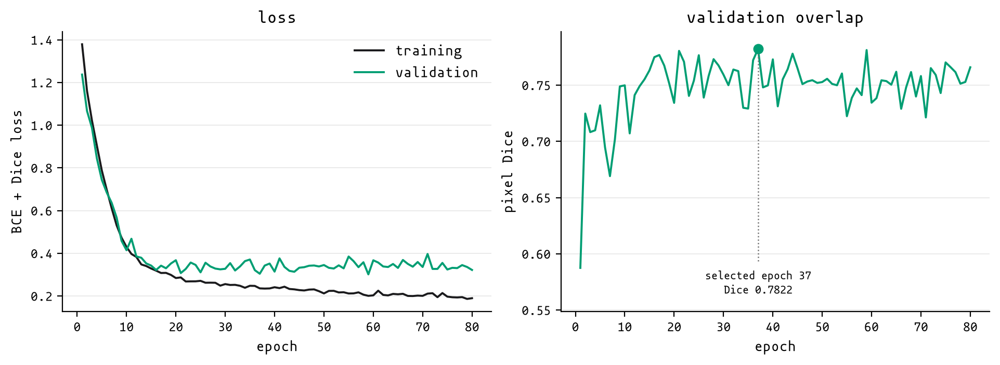

# FibreSight methods

`fibre_sight_ch2_v1.pt` came from 53 hand-labelled dLight imaging sessions and an 80-epoch training run completed on 12 May 2026. The workbench controls, labelling decisions and training record are kept here; fixed artefact details, intended use and licence remain in the [model card](MODEL_CARD.md).

## prediction controls

The network produces one foreground probability for every image pixel. The controls below convert that probability map into connected ROI components; changing `prediction threshold` or `minimum ROI area (pixels)` reuses the probability map already held in memory.

| control | default | effect |
| --- | ---: | --- |
| `prediction threshold` | `0.25` | Confidence threshold applied to each pixel. Lower values retain weaker and dimmer responses; higher values retain fewer pixels. |
| `minimum ROI area (pixels)` | `45` pixels | Removes connected components smaller than this area after thresholding. Dimness sensitivity stays unchanged. |
| four-view TTA | on | Averages the original image and its horizontal, vertical and two-axis flips. The CLI and API can disable it. |

A faint process with visible confidence can sometimes be recovered by lowering the `prediction threshold`. A process absent from the confidence map falls outside the class learned by this checkpoint; `minimum ROI area (pixels)` acts only on components already present.

## MSER controls

The older MSER route remains in the workbench because it was the proposal method used before the U-Net existed, and it is still useful when a new image falls outside the checkpoint's training distribution. MSER has its own image preparation, stability and shape filters; model prediction uses a separate probability map and ignores these values.

| control | default | effect |
| --- | ---: | --- |
| `brightness threshold` | `85.0` | Brightness percentile applied before candidate detection. |
| `candidate area minimum` | `30` pixels | Lower bound for regions passed to MSER. |
| `candidate area maximum` | `15000` pixels | Upper bound for regions passed to MSER. |
| `delta` | `5` | Intensity step used when MSER tests region stability. |
| `maximum variation` | `1.2` | Stability filter; lower values are stricter. |
| `ROI area minimum` | `30` pixels | Lower bound for final ROIs after shape filtering. |
| `eccentricity minimum` | `0.75` | Higher values favour elongated regions. |
| `aspect-ratio minimum` | `1.2` | Minimum long-axis to short-axis ratio. |
| `solidity minimum` | `0.1` | Minimum filled-area ratio accepted for a candidate. |
| `thinness maximum` | `0.8` | Compactness ceiling; lower values favour thinner regions. |
| `tophat kernel` | `11` pixels | Scale of the background-removal filter used before MSER. |
| `CLAHE clip` | `2.0` | Strength of local contrast equalisation. |
| `intensity clip` | `99.0` | Upper intensity percentile used before MSER normalisation. |

Fixed ROIs are written into the label image before a new MSER pass, so a hand decision survives later changes to these controls.

## labels and data split

Each session contributed one two-dimensional `ref_mat_ch2.npy` reference and one curated ROI dictionary. Every ROI dictionary stored the `xpix` and `ypix` coordinates of its accepted axonal regions; overlapping coordinates were combined into one foreground mask for training.

Dim, out-of-plane processes were generally left unlabelled. Their fluorescence spread into the background and could not be assigned cleanly to one axonal ROI for later dLight analysis. The target describes the in-plane processes which a curator would retain; fibre-like traces outside that convention remain background.

The final manifest contained 53 usable sessions from four animals and 1,296 curated ROIs:

| split | sessions | curated ROIs | foreground pixels |
| --- | ---: | ---: | ---: |
| training | 37 | 892 | 359,351 |
| validation | 7 | 177 | 72,749 |
| test | 9 | 227 | 85,698 |

The split was made at session level. All four animals appeared in each split, so the test set is session-held-out within the same animals and acquisition source. Full reference images and ROI dictionaries remain private. The three arrays under `examples/` are unlabelled 256 × 256 crops released for running the public software.

## image preparation and sampling

Each full reference image was clipped and scaled between its 1st and 99.7th intensity percentiles. The training loader then drew 24 patches of 256 × 256 pixels per session during each epoch; 75% of crop centres were sampled from foreground pixels, whilst the remainder were placed randomly so that background-only patches remained part of the task. Validation used eight patches per session without augmentation.

Training augmentation used independent horizontal and vertical flips, lossless rotations in 90-degree steps, intensity scaling of up to 15%, a small intensity offset, and Gaussian noise with a standard deviation of `0.02` after normalisation. These choices are now exposed in the recipe YAML under `data.augmentation` (`rotation_90`, `noise_sd`) so that ablations do not require code edits; the released checkpoint used both rotations and noise at the values above. The random crop and augmentation sequence changed with the epoch and remained reproducible from seed `7`.

## network and optimisation

The selected model is the package's `SmallUNet`: one input channel, one foreground-logit output channel, four resolution levels and base width `24`, giving channel widths of 24, 48, 96 and 192. Each level uses two 3 × 3 convolution, batch-normalisation and ReLU blocks; downsampling uses max pooling, whilst the decoder uses transposed convolution and skip connections.

The loss was the equally weighted sum of binary cross-entropy with logits and soft Dice loss. AdamW used a learning rate of `3e-4`, weight decay of `1e-5` and batch size `8`; training ran for 80 epochs with automatic mixed precision when CUDA was available. The complete recipe remains in [`ch2_unet.yaml`](src/fibre_sight/configs/ch2_unet.yaml).

## checkpoint selection and training history

The training loop saved the weights with the highest mean validation patch Dice, calculated at a probability threshold of `0.5` before connected-component filtering. Epoch 37 reached `0.7821986335` and became the released checkpoint; validation loss reached its minimum later, at epoch 59, but validation Dice was the selection rule fixed in the training code.

The plotted values are available as [`training-history.csv`](docs/data/training-history.csv). The public checkpoint contains model weights and inference metadata only.

## choosing the released operating point

Threshold and minimum component size were tuned after the network weights had been fixed. A validation sweep reused the saved probability maps and compared Dice, F2, precision, recall and component count for each setting; four-view flip averaging was included in the sweep used for the released workbench.

| validation setting | threshold | minimum size | Dice | F2 | precision | recall | predicted components per session |
| --- | ---: | ---: | ---: | ---: | ---: | ---: | ---: |
| F2 maximum | 0.20 | 30 | 0.7686 | 0.8435 | 0.6778 | 0.9091 | 40.1 |
| released | 0.25 | 45 | 0.7753 | 0.8368 | 0.6983 | 0.8888 | 35.1 |
| Dice maximum | 0.60 | 60 | 0.7966 | 0.8016 | 0.7974 | 0.8078 | 29.0 |

The released `0.25 / 45` setting sits between the most recall-heavy and Dice-heavy validation optima. ROI overlays and component counts were inspected alongside these pixel scores because a setting with high foreground overlap can still split one axon into several proposals, or merge neighbouring axons into one.

Gradient training and epoch selection used the training and validation splits. The nine test sessions entered the decision record later, when their results were consulted whilst settling the public postprocessing setting; the reported test scores are therefore a descriptive evaluation of the released configuration. A future animal-held-out evaluation with a fixed operating point would provide a cleaner external estimate.

## evaluation metrics

Evaluation thresholded the full-image probability maps, removed components smaller than 45 pixels, and calculated one set of foreground-pixel scores for each session. The reported values are means across the nine test sessions:

| metric | definition | mean |
| --- | --- | ---: |
| Dice | `2TP / (2TP + FP + FN)` | 0.7226541 |
| intersection over union | `TP / (TP + FP + FN)` | 0.5687023 |
| precision | `TP / (TP + FP)` | 0.5957682 |
| recall | `TP / (TP + FN)` | 0.9260965 |
| F2 | `5TP / (5TP + 4FN + FP)` | 0.8312405 |

The released setting predicted a mean of 38.2 connected components per test session; the curated targets contained 25.2. Pixel metrics describe foreground overlap and give only an indirect account of ROI identity, so split and merge errors still require inspection in the editor.

## retained experiments

Three alternative recipes remain beside the selected baseline. Each changed one dimension of the training setup whilst holding the rest fixed; the training pipeline seeds numpy and torch from the recipe's `train.seed` value before model initialisation, so single-variable comparisons are reproducible.

**`ch2_unet_aux_recall.yaml`** added a dilated support target (binary dilation with radius 3 around each foreground mask) and replaced soft Dice with Tversky loss (`alpha=0.15, beta=0.85`), penalising false negatives far more than false positives. The model widened to base channels 32, output two channels (foreground + support), and trained for 100 epochs at a higher foreground crop fraction (0.85). This was the recall-heavy extreme; the released postprocessing already favours recall through a low confidence threshold, so the additional recall from a modified loss did not justify the added complexity.

**`ch2_unet_512.yaml`** doubled the crop size to 512 pixels and widened the base channels to 32, giving the network more spatial context per patch. This was a sanity check that the 256-pixel baseline was not leaving performance on the table; the smaller model remained the released checkpoint.

**`ch2_unet_attention.yaml`** added attention gates to the skip connections of the standard `SmallUNet` whilst keeping the 256-pixel crop, base width 24, BCE + Dice loss, and seed 7 unchanged. The gate projects skip features and the upsampled decoder features into a shared low-dimensional space (half the minimum of skip and gate channels), applies ReLU then a 1×1 convolution to a single-channel sigmoid score, and multiplies that score back onto the skip path before concatenation. The decoder path itself is unmodified; only the skip contribution is gated. In our tests the attention-gated variant performed comparably to the standard U-Net on the same data. The recipe is included for cases where the training data contains more heterogeneous backgrounds and the skip connections might benefit from learned suppression of irrelevant features.

The 256-pixel ungated baseline remained the released model. The comparison stopped with these working trials whilst the labelling and curation loop was still changing. The full [training guide](TRAINING.md) describes each recipe and how to write a new one.

## scope

The checkpoint was trained and tested within one dLight acquisition source. Percentile normalisation handles simple changes in signal scale. A new indicator, microscope point-spread function, field size, background texture, or labelling convention changes the spatial problem and remains outside that correction. Images from another domain need hand-labelled checks; repeated misses in the confidence map are evidence for retraining, whilst below-threshold responses can be explored with the prediction controls at the top of this file.
