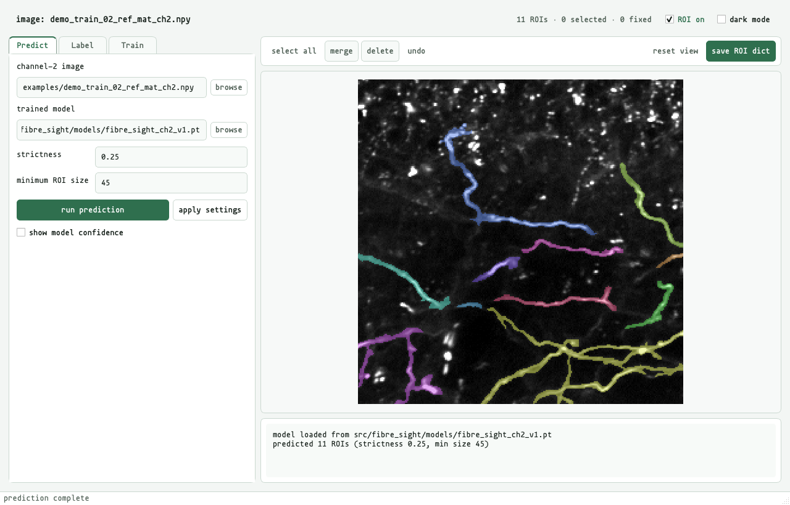
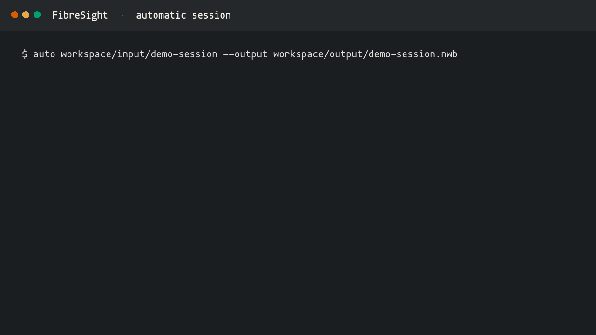
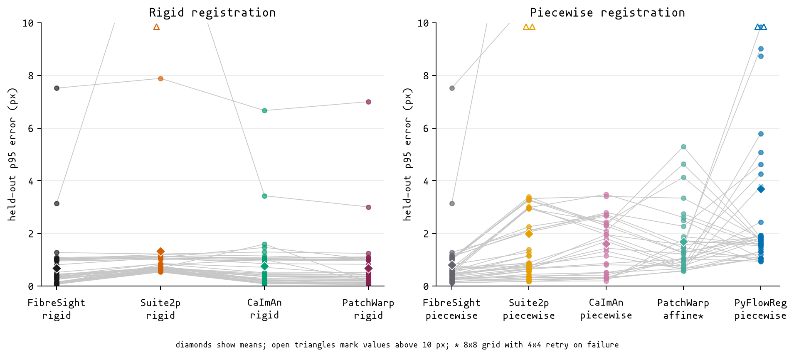
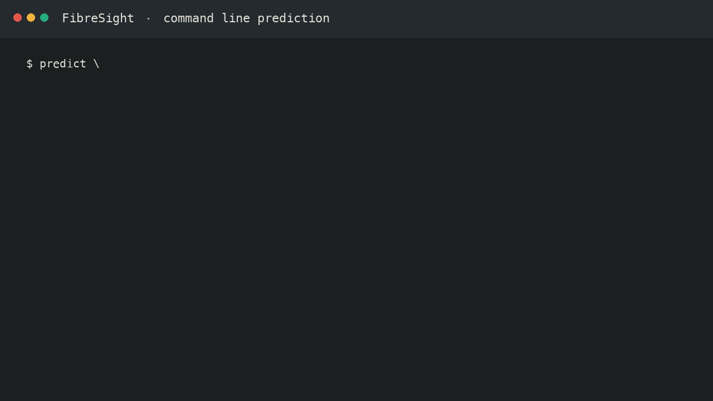
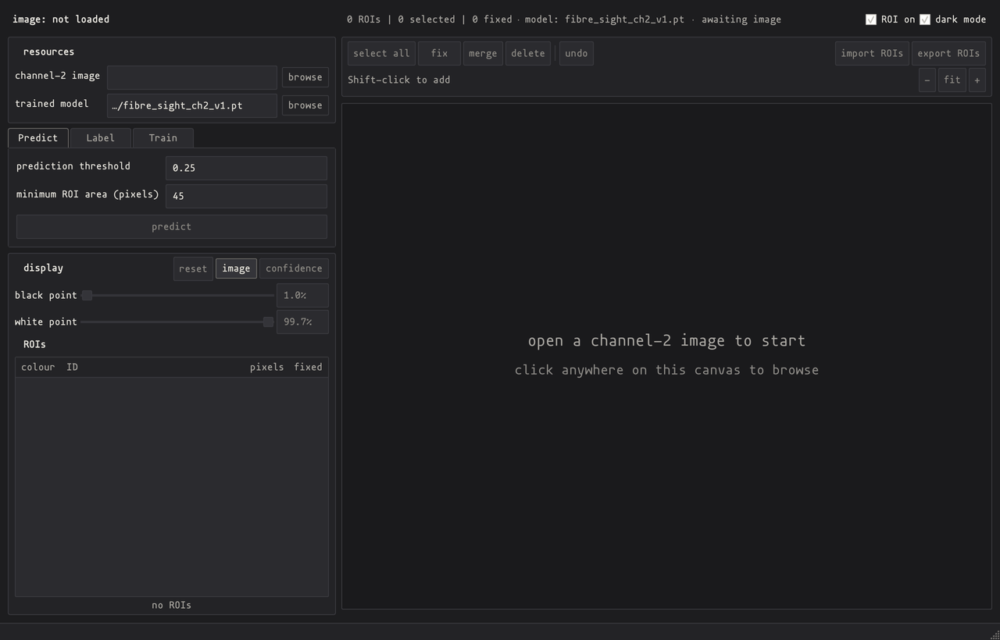

# FibreSight

[](https://github.com/dinghaoluo/fibre-sight/actions/workflows/tests.yml)
[](LICENSE)
[](https://github.com/dinghaoluo/fibre-sight/releases/latest)


Most established two-photon analysis software and algorithms were developed for somatic calcium recordings, where the high signal-to-noise and the regularity of cell shapes supply ample image structure for motion correction and ROI identification. Axon imaging is usually analysed using the same workflow, but with less information, since a labelled process may occupy only a few pixels, its sensor fluorescence may be faint, and residual motion or an offset between structural and functional channels can change the pixels assigned to a trace.

**FibreSight is an integrated workbench that presents the end-to-end registration-ROI-extraction-dF/F pipeline as a single, NWB-supported package, specifically optimised for axon imaging.** Roughly, a full-pipeline run consists of 5 steps: a) TIFF movie ingestion, b) registration, c) frame quality-control, d) axon ROI segmentation, and e) extraction & dF/F calculation.

Being optimised for axon imaging, specifically, entails two features:

- Firstly, **registration**, both rigid and piecewise, performs well enough for regular somatic calcium imaging data, but significantly better for axon imaging data compared to pre-existing algorithms. In the current public benchmark, FibreSight's rigid registration matched [PatchWarp](https://github.com/ryhattori/PatchWarp), and its piecewise method had the lowest held-out displacement error amongst the competing non-rigid algorithms, including but not limited to [Suite2p](https://github.com/Mouseland/suite2p) and [CaImAn](https://github.com/flatironinstitute/caiman).
- Secondly, a U-Net convolutional neural network supports high-accuracy **auto-segmentation of axon ROIs**, and a similarly-performant Attention U-Net model is provided as well. If needs be, one can also train their own model using the bundled training pipeline, which walks through manual curation of training data, training manifest preparation, and training and validation.

A full run can be triggered within the `AUTO` tab, whereas command-line tools expose the same recording stages for scripted runs. The bundled U-Net checkpoint works out of the box on images resembling its training data. See the [model card](MODEL_CARD.md) and [methods record](METHODS.md) for more detail on the checkpoint. [How to Train Your Model™](TRAINING.md), on the other hand, provides a step-by-step guide to training a new model from scratch.



## quick start

From the cloned repository root:

```powershell
conda env create -f environment.yml
conda activate fibre-sight
python -m fibre_sight  # note that it is an underscore, not a hyphen
```

`run_fibre_sight.bat` starts the same workbench on Windows after the environment has been activated; `sh run_fibre_sight.sh` does the same on macOS and Linux. An editable pip installation is also sufficient:

```powershell
python -m venv .venv
.\.venv\Scripts\Activate.ps1
python -m pip install -e .
fibre-sight
```

Only the activation line differs on macOS and Linux:

```sh
python -m venv .venv
source .venv/bin/activate
python -m pip install -e .
fibre-sight
```

Training and inference default to automatic device selection: PyTorch uses CUDA when it is available, then Apple's MPS backend on Apple silicon, then CPU. MPS requires a native arm64 Python interpreter and macOS 12.3 or later; `python -c "import platform; print(platform.machine())"` should print `arm64`.

## full TIFF-to-dF/F pipeline

This is the main recording route:

```text
paired TIFF pages -> registered NWB -> proposed ROIs -> curated ROIs -> fluorescence -> dF/F
```

The full-pipeline run can be triggered either within the GUI's `auto` tab or using CLI.



### full-pipeline run using CLI

The GUI's `auto` tab provides an intuitive layout to set various parameters and start a full-pipeline run. Alternatively, to run a session using CLI, simply give `auto` the input folder and an NWB output path:

```sh
# TIFFs -> registered NWB -> proposals -> fluorescence -> dF/F
auto /path/to/session --output workspace/output/session.nwb

# n.b.: if the signal and control TIFFs are stored
# in separate folders, add these two arguments
auto /path/to/session --layout separate \
    --control-tiff-dir /path/to/control \
    --output workspace/output/session.nwb
```

*n.b.: If the signal and control TIFFs are stored in separate folders, add `--layout separate --control-tiff-dir /path/to/control`.*

The command writes a `.fibresight.jsonl` session log beside the NWB file. To resume an interrupted run, rerun the same command; the log is loaded automatically and completed stages whose outputs match it are retained. A log can also be passed directly to the `auto` command:

```sh
auto /path/to/session.fibresight.jsonl
```

The adjustable command-line parameters are:

- **recording**: `--layout`, `--control-tiff-dir`, `--signal-channel`, `--control-channel`, `--sampling-frequency`, `--signal-label`, `--control-label`, and `--pixel-size`;
- **output and registration**: `--output`, `--registration-model` (`rigid`, `piecewise`, or `auto`), and `--registration-channel`;
- **segmentation**: `--reference-channel`, `--reference-low-percentile`, `--reference-high-percentile`, `--checkpoint`, `--threshold`, `--min-size`, `--no-tta`, and `--device` (`auto`, `cpu`, `mps`, or `cuda`);
- **fluorescence**: `--proposal-run`, `--roi-run`, `--fluorescence-run`, `--surround-method` (`adaptive` or `fixed`), `--surround-inner-px`, `--surround-outer-px`, and `--surround-min-pixels`;
- **dF/F**: `--dff-run`, `--statistic` (`mean` or `median`), `--baseline-percentile`, `--baseline-window-s`, `--surround-coefficient`, and `--control-correction` (`none` or `subtract_dff`).

In addition, stages of the full pipeline can be called individually as well. Here are a few important calls:

```sh
# registration only
registration /path/to/session --output workspace/output/session.nwb

# ROI prediction which only requires the reference image
# the reference is constructed during registration
predict --image /path/to/reference.npy \
    --checkpoint /path/to/model.pt \
    --out workspace/output/predicted_ROI_dict.npy

# inspect all the previous runs stored in an NWB file
list-runs workspace/output/session.nwb
```

Every analysis run is named and immutable. A later curation or dF/F choice produces another run in the same NWB file instead of replacing the earlier one. This was done to encourage reproducibility and traceability.

### registration

`preprocess_recording(...)` indexes the TIFF pages without loading the complete recording into memory, estimates either one shared rigid motion trajectory or a piecewise field from the chosen registration channel, applies the correction to both channels, and writes the registered movies and frame-level QC into NWB. Its separate segmentation reference averages all analysis-valid frames from the chosen segmentation channel, clips the full-session mean at `p1-p97`, and retains the exact source-frame and intensity provenance.

```python
from pathlib import Path

from fibre_sight.api import preprocess_recording, segment_recording

tiff_paths = sorted(Path('/path/to/session').glob('*.tif'))
nwb_path = Path('workspace/output/session.nwb')

preprocess_recording(
    tiff_paths,
    nwb_path,
    signal_channel=1,
    control_channel=2,
    multiplexed=True,
    sampling_frequency_hz=30,
    signal_label='dLight',
    control_label='tdTomato',
    registration_model='auto',
    )

segment_recording(nwb_path, 'proposal_v1')
```

`registration_model='auto'` compares rigid and piecewise registration during calibration and uses the piecewise method only when its held-out gains meet the recorded thresholds. The exact warped-pixel support is reconstructed from the stored spline field during segmentation-reference construction and fluorescence extraction, so an accepted piecewise run can continue through dF/F.



Ten public reference images are crossed with four motion recipes; grey lines connect matching cases and diamonds mark method means. The [benchmark notes](BENCHMARK.md) record the method versions, incomplete external runs and claim boundaries. The [rigid](examples/rigid_registration_benchmark.mp4) and [piecewise](examples/piecewise_registration_benchmark.mp4) comparison movies show raw, FibreSight, Suite2p and CaImAn in that order.

### segmentation and curation

`segment_recording(...)` applies the bundled checkpoint to the stored `p1-p97` segmentation reference and adds a named proposal run to the NWB file. Older files fall back first to their legacy proposal reference, when present, then to the registration anchor. Each run records the exact reference, checkpoint hash and proposal settings.

Start `fibre-sight`, select the NWB file under `channel-2 image`, choose `proposal_v1`, then inspect, delete or merge its ROIs. Enter `curated_v1` as the new run name and click `save curated run`. The proposal remains unchanged; the curated run records it as its source.

Canvas and ROI-table selections are linked. The workbench supports multiselection, deletion, merging, undo, pan, and zoom, adjustable black and white points, dark and light modes, and adjustable interface text size. A proposal probability map can be rebuilt at another threshold without another model pass.

The bundled test crop follows the shorter prediction route from the command line:



### fluorescence extraction and dF/F

After curation, continue through the API:

```python
from fibre_sight.api import (
    calculate_dff,
    extract_fluorescence,
    plot_dff_traces,
    )

extract_fluorescence(nwb_path, 'fluorescence_v1', 'curated_v1')
calculate_dff(nwb_path, 'dff_v1', 'fluorescence_v1')
plot_dff_traces(
    nwb_path,
    'dff_v1',
    'workspace/output/dff_trace_qa.png',
    roi_ids=[1, 2],
    )
```

Extraction stores ROI and surrounding-pixel statistics for both channels. The dF/F stage applies the recorded `analysis_valid` mask, surround subtraction and a centred rolling baseline; rejected observations remain NaN and are never interpolated in the canonical traces. The [methods record](METHODS.md#fluorescence-extraction-and-dff) gives the defaults and their basis.

## quick segmentation demo

Three unlabelled 256 × 256 crops are included under `examples/`: two come from sessions in the training split, and `lab-fibresight-demo-test.npy` comes from one of the nine test sessions. Each array has a same-stem PNG preview. This small route tests checkpoint inference without a TIFF movie or NWB file:

```sh
predict --image examples/lab-fibresight-demo-test.npy --out workspace/output/demo_predicted_ROI_dict.npy
```

The command uses the bundled checkpoint, chooses the available compute device, prints the number of proposed ROIs, and creates `workspace/output/` when needed. To inspect the same crop in the GUI, start `fibre-sight`, select the `.npy` under `channel-2 image`, open `segment`, then click `predict`. Predictions and edits are written under `workspace/output/`; the six shipped `.npy` and PNG files remain unchanged.



Higher `prediction threshold` values retain fewer, more confident ROIs. `minimum ROI area (pixels)` removes small connected components after thresholding. The `confidence` view shows the probability map beneath the ROI outlines; `ROI on / ROI off` hides those outlines without changing the current view. The [methods record](METHODS.md#prediction-controls) gives the defaults and direction of every prediction and MSER control.

The [pipeline demos](examples/README.md#pipeline-demos) show the other end of the workflow: the console messages from a complete automatic run and the same prediction route from the command line.

## checkpoint performance

The released checkpoint reached its best validation Dice of `0.7822` at epoch 37 of 80. On nine session-held-out test sessions from the same four animals and acquisition source, the released operating point (`0.25` threshold, `45` minimum pixels, four-view TTA) gives:

| metric    | mean   |
| --------- | ------:|
| Dice      | 0.7227 |
| recall    | 0.9261 |
| precision | 0.5958 |
| F2        | 0.8312 |

The operating point favours recall over precision. A false-positive proposal can be selected and deleted in the workbench; a missed axon must currently be drawn outside the workbench and imported.


Full metrics, the threshold sweep, and the training record are kept in the [model card](MODEL_CARD.md) and [methods record](METHODS.md). The plotted values are available as [`training-history.csv`](docs/data/training-history.csv).

## checkpoint portability

The checkpoint was trained on channel-2 references acquired and processed within one dLight dataset. Percentile normalisation absorbs simple changes in intensity scale, although a different indicator, microscope, field size, background texture or axon morphology can still change what the network recognises. New image domains should be checked against hand labels and may require retraining.

## workspace

Working data stay outside the package. A clone uses `workspace/` at the repository root by default:

```text
workspace/
    labelled_sessions/
    manifests/
    output/
        figures/
        runs/
```

Installed copies outside a checkout use `~/fibre-sight`. Setting `FIBRE_SIGHT_WORKSPACE` overrides both locations; all relative paths in the supplied training recipes resolve against that workspace.

The manifest builder expects two files in each labelled session:

```text
<session>/processed_data/ref_mat_ch2.npy
<session>/processed_data/*_ROI_dict.npy
```

ROI dictionaries use a legacy pickled NumPy format. `scan labelled sessions` writes a CSV containing the image and ROI paths, summaries, inclusion state, and the train, validation or test split. The scanner currently infers the animal or subject group from the part of the session folder name before the first hyphen; inspect the `animal` and `split` columns before training, particularly when using another experimenter's folder convention.

## command-line tools

Installing FibreSight adds these command-line tools alongside the GUI:

```text
auto
registration
segment
fluorescence
dff
predict
build-manifest
train
evaluate
list-runs
plot-traces
```

Each command accepts `--help`. The same tools can be run as modules, for example `python -m fibre_sight.predict_rois --help`.

`registration` takes a TIFF folder and writes the registered NWB file; `segment`, `fluorescence`, and `dff` continue named runs in that file; `predict` takes a reference `.npy` image and writes an ROI dictionary. The remaining commands build manifests, train or evaluate checkpoints, inspect runs, or plot traces.

The same stages are available as Python functions, so they can be placed inside a larger analysis script or loop:

```python
from pathlib import Path

import numpy as np

from fibre_sight.api import (
    BUNDLED_CHECKPOINT,
    ROIPredictor,
    calculate_dff,
    extract_fluorescence,
    preprocess_recording,
    segment_recording,
    )
from fibre_sight.list_runs import list_analysis_runs
from fibre_sight.plot_traces import plot_dff_traces
from fibre_sight.predict_rois import predict_roi_dict

tiff_paths = sorted(Path('/path/to/session').glob('*.tif'))
nwb_path = Path('workspace/output/session.nwb')

# recording stages
preprocess_recording(
    tiff_paths,
    nwb_path,
    signal_channel=1,
    control_channel=2,
    multiplexed=True,
    sampling_frequency_hz=30,
    registration_model='auto',
    )
segment_recording(nwb_path, 'proposal_v1')
extract_fluorescence(nwb_path, 'fluorescence_v1', 'proposal_v1')
calculate_dff(nwb_path, 'dff_v1', 'fluorescence_v1')

# image-only prediction
predict_roi_dict(
    '/path/to/reference.npy',
    BUNDLED_CHECKPOINT,
    out_path='workspace/output/predicted_ROI_dict.npy',
    tta=True,  # test-time augmentation
    )

# use a predictor when several images share one loaded model
predictor = ROIPredictor(BUNDLED_CHECKPOINT, tta=True)
image = np.load('/path/to/reference.npy')
roi_dict, labelled, probability = predictor.predict_image(image)

runs = list_analysis_runs(nwb_path)
plot_dff_traces(nwb_path, 'dff_v1', 'workspace/output/dff_trace_qa.png')
```

In addition, to inspect selected traces from a derived dF/F run:

```sh
plot-traces recording.nwb dff_v1 \
    --out workspace/output/dff_trace_qa.png --roi-id 1 --roi-id 2
```

Training recipes are kept under `src/fibre_sight/configs/`. [How to Train Your Model™](TRAINING.md) describes each recipe and how to write a new one.

## verification

Run the standalone tests from the repository root:

```powershell
python -m unittest discover -s tests -v
```

## cite FibreSight

If FibreSight contributes to published work, please cite the software version used:

```text
Luo, D. (2026). FibreSight (Version 0.2.0) [Computer software]. https://github.com/dinghaoluo/fibre-sight
```

GitHub's `Cite this repository` menu generates other citation formats from [`CITATION.cff`](CITATION.cff).

## repository scope

This repository contains the active FibreSight workbench extracted from a larger analysis repository. The pretrained checkpoint contains model weights and inference metadata; full source images and hand-labelled ROI dictionaries remain private. The ten registration references under `benchmarking/sources/` are cropped, unlabelled arrays with same-stem PNGs and a separate provenance record.

The source code, bundled checkpoint, and demonstration arrays are released under the [MIT License](LICENSE). Mononoki 1.006 by Matthias Tellen is bundled for the interface under the [SIL Open Font License 1.1](src/fibre_sight/assets/fonts/mononoki/LICENSE); its [font note](src/fibre_sight/assets/fonts/mononoki/README.md) records the upstream release.
