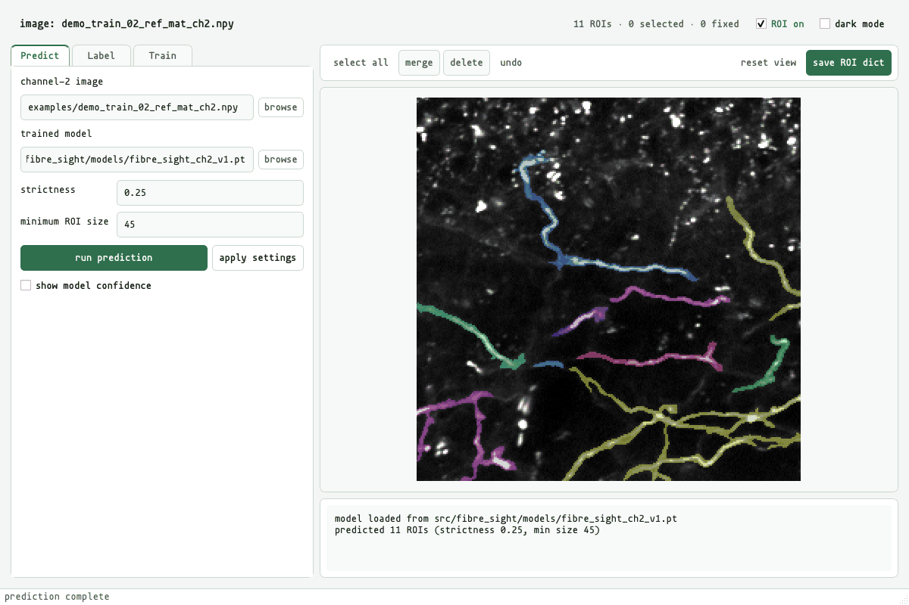

# Fibre Sight

[](../../actions/workflows/tests.yml)

Hand-segmenting axon ROIs took days for each dataset, and the resulting boundaries varied between people. Fibre Sight reads two-dimensional channel-2 reference arrays (`ref_mat_ch2.npy`) and predicts candidate ROIs; the workbench combines a bundled U-Net, the older MSER proposal route, and manual curation, so each proposal can be inspected, deleted, or merged before the resulting `xpix` and `ypix` dictionary is saved.


The bundled `fibre_sight_ch2_v1.pt` checkpoint ([model card](MODEL_CARD.md); [methods and training record](METHODS.md)) was trained on hand-labelled channel-2 axon images. Its default operating point favours recall, with a confidence threshold of `0.25`, a minimum component size of `45` pixels, and four-view flip test-time augmentation.

## quick start

From the cloned repository root:

```powershell
conda env create -f environment.yml
conda activate fibre-sight
python -m fibre_sight
```

`run_fibre_sight.bat` starts the same workbench on Windows after the environment has been activated; `sh run_fibre_sight.sh` does the same on macOS and Linux. An editable pip installation is also sufficient:

```powershell
python -m venv .venv
.\.venv\Scripts\Activate.ps1
python -m pip install -e .
fibre-sight
```

Only the activation line differs on macOS and Linux:

```sh
python -m venv .venv
source .venv/bin/activate
python -m pip install -e .
fibre-sight
```

PyTorch selects CUDA when a compatible GPU build is present; CPU inference uses the same checkpoint.

On macOS the Python interpreter must be arm64. PyTorch has published no macOS x86_64 wheels since 2.2.2, so an Intel build, including an Anaconda installation running under Rosetta, cannot satisfy the `torch>=2.3` requirement; pip reports that no matching distribution was found and lists nothing above 2.2.2. Check with `python -c "import platform; print(platform.machine())"`, which should print `arm64`. If it prints `x86_64`, install a native arm64 conda such as Miniforge, or use an arm64 Homebrew Python.

## quick demo

Three unlabelled 256 × 256 crops are included under `examples/`: two come from sessions in the training split, and `demo_test_ref_mat_ch2.npy` comes from one of the nine test sessions. The command below runs prediction on that test crop; the metrics in the [model card](MODEL_CARD.md) were calculated across the nine complete test sessions.

From the repository root:

```sh
fibre-sight-predict --image examples/demo_test_ref_mat_ch2.npy --out workspace/output/demo_predicted_ROI_dict.npy --device cpu
```

The command uses the bundled checkpoint, prints the number of predicted ROIs, and creates `workspace/output/` when needed. To inspect the same crop in the GUI, start `fibre-sight`, open `predict + curate`, select `examples/demo_test_ref_mat_ch2.npy`, click `load trained model`, then `predict`. `show model confidence` places the confidence map beneath the editable ROI outlines.

## predict and curate

1. Open the `predict + curate` tab and select a two-dimensional channel-2 reference `.npy` file.
2. Leave the bundled checkpoint selected, then click `load trained model`.
3. Click `predict`. The confidence map is retained in memory, so `strictness` and `min ROI size` can be adjusted without another model pass.
4. Inspect the outlines, delete poor proposals, merge fragments when needed, and save the ROI dictionary.



Higher `strictness` values retain fewer pixels. `min ROI size` removes small connected components after thresholding. `show model confidence` places the confidence map beneath the ROI outlines; `ROI on / ROI off` leaves the image visible without outlines when the raw channel-2 reference needs inspection. The [methods](METHODS.md#prediction-controls) record gives the defaults and the direction of every prediction and MSER control.

The `MSER + training` tab keeps the earlier MSER proposal route available for new labelling and difficult images. Running MSER again leaves fixed ROIs in place; MSER proposals, loaded labels, and U-Net predictions appear in the same editor.

## common questions

### Why are some faint fibres missed?

The hand labels generally excluded dim, out-of-plane processes. In dLight imaging their fluorescence spreads into the background and cannot be assigned cleanly to one axonal ROI for later analysis. `show model confidence` reveals whether the model gave such a structure a weak response: lowering `strictness` may recover a response below the default `0.25`, while a structure absent from the confidence map falls outside what the checkpoint learned and needs new labels and retraining.

### Why are there too many or fragmented ROIs?

The released `0.25 / 45` operating point favours recall, so false-positive pixels and fragmented components are expected. Raising `strictness` removes weaker responses; raising `min ROI size` removes small connected components. The remaining proposals can be deleted or merged in the editor before the ROI dictionary is saved.

### Will the bundled checkpoint work on images from another setup?

The checkpoint was trained on channel-2 references acquired and processed within one dLight dataset. Percentile normalisation absorbs simple changes in intensity scale, although a different indicator, microscope, field size, background texture or axon morphology can still change what the network recognises. New image domains should be checked against hand labels and may require retraining.

## workspace

Working data stay outside the package. A clone uses `workspace/` at the repository root by default:

```text
workspace/
    labelled_sessions/
    manifests/
    output/
        figures/
        runs/
```

Installed copies outside a checkout use `~/fibre-sight`. Setting `FIBRE_SIGHT_WORKSPACE` overrides both locations; all relative paths in the supplied training recipes resolve against that workspace.

The manifest builder expects two files in each labelled session:

```text
<session>/processed_data/ref_mat_ch2.npy
<session>/processed_data/*_ROI_dict.npy
```

The reference array and ROI dictionary must describe the same image. `scan labelled sessions` writes a CSV containing the image and ROI paths, summaries, inclusion state, and the train, validation, or test split.

## command-line tools

Installing Fibre Sight adds four command-line tools alongside the GUI:

```text
fibre-sight-build-manifest
fibre-sight-train
fibre-sight-predict
fibre-sight-evaluate
```

Each command accepts `--help`. The same tools can be run as modules, for example `python -m fibre_sight.predict_rois --help`.

The prediction command uses the bundled checkpoint and its saved operating point by default:

```sh
fibre-sight-predict --image examples/demo_test_ref_mat_ch2.npy --out workspace/output/demo_predicted_ROI_dict.npy --device cpu
```

Three training recipes are retained under `src/fibre_sight/configs/`: `ch2_unet.yaml` is the default 256-pixel crop recipe, `ch2_unet_aux_recall.yaml` is the support-target recall trial, and `ch2_unet_512.yaml` is the wider 512-pixel crop trial. These are working experiments; no exhaustive model comparison was run.

## verification

Run the standalone tests from the repository root:

```powershell
python -m unittest discover -s tests -v
```

## repository scope

This repository contains the active Fibre Sight workbench extracted from a larger analysis repository. The pretrained checkpoint contains model weights and inference metadata; full source images and hand-labelled ROI dictionaries remain private. The three arrays under `examples/` are the cropped, unlabelled references described above.

The source code, bundled checkpoint, and demonstration arrays are released under the [MIT License](LICENSE). Mononoki 1.006 by Matthias Tellen is bundled for the interface under the [SIL Open Font License 1.1](src/fibre_sight/assets/fonts/mononoki/LICENSE); its [font note](src/fibre_sight/assets/fonts/mononoki/README.md) records the upstream release.
