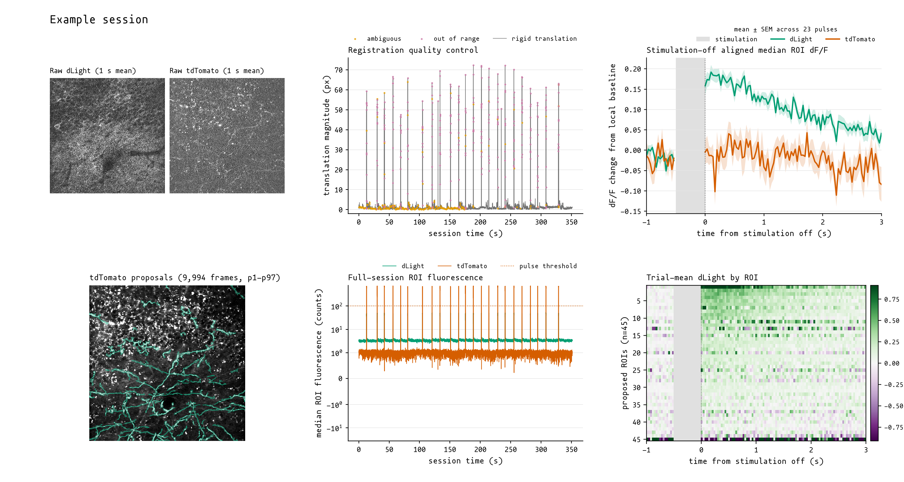

# FibreSight

[](https://github.com/dinghaoluo/fibre-sight/actions/workflows/tests.yml)

FibreSight follows paired two-photon recordings from interleaved TIFF pages through registration, axonal ROI segmentation and curation, fluorescence extraction, and dF/F. The registered movies, quality-control decisions, reference images, ROI runs and derived traces remain together in one NWB file. A GUI handles proposal inspection and curation; the Python API and command-line tools handle the recording-scale stages.

The repository also contains the complete training route for a different image domain, from MSER-assisted labelling to U-Net training and session-held-out evaluation. [How to Train Your Model™](TRAINING.md) documents that route.


The bundled checkpoint was developed from 53 hand-labelled two-photon sessions containing 1,296 curated ROIs. It reached 0.926 foreground-pixel recall on nine session-held-out images from the same four animals and acquisition source; its operating point deliberately favours over-proposal. The [model card](MODEL_CARD.md) and [methods record](METHODS.md) give the full evaluation and its limits.

## quick start

From the cloned repository root:

```powershell
conda env create -f environment.yml
conda activate fibre-sight
python -m fibre_sight  # note that it is an underscore, not a hyphen
```

`run_fibre_sight.bat` starts the same workbench on Windows after the environment has been activated; `sh run_fibre_sight.sh` does the same on macOS and Linux. An editable pip installation is also sufficient:

```powershell
python -m venv .venv
.\.venv\Scripts\Activate.ps1
python -m pip install -e .
fibre-sight
```

Only the activation line differs on macOS and Linux:

```sh
python -m venv .venv
source .venv/bin/activate
python -m pip install -e .
fibre-sight
```

Training and inference default to automatic device selection: PyTorch uses CUDA when it is available, then Apple's MPS backend on Apple silicon, then CPU. MPS requires a native arm64 Python interpreter and macOS 12.3 or later; `python -c "import platform; print(platform.machine())"` should print `arm64`.

## complete recording pipeline

This is the main recording route:

```text
paired TIFF pages -> registered NWB -> proposed ROIs -> curated ROIs -> fluorescence -> dF/F
```

Every analysis run is named and immutable. A later curation or dF/F choice produces another run in the same NWB file instead of silently replacing the earlier one.



This example follows internal session `A126i-20250606-02`: six interleaved TIFF files, 10,548 paired frames, rigid registration, a 9,994-frame `p1-p97` tdTomato segmentation reference, 45 proposals from the bundled checkpoint, and stimulation-off-aligned dLight and tdTomato traces. The brief image-wide tdTomato excursions recover 23 stimulation periods directly from the movie. Of the 45 proposed ROIs, 42 had a positive mean dLight change from 0.1 to 1.0 s after offset; the median was `+0.142`, compared with `+0.004` in tdTomato. The TIFFs and 4.9 GB NWB file are not distributed. [`benchmarking/full_session_demo.py`](benchmarking/full_session_demo.py) records the session-specific alignment and plotting choices.

### registration

`preprocess_recording(...)` indexes the TIFF pages without loading the complete recording into memory, estimates one shared motion trajectory from the chosen registration channel, applies it to both channels, and writes the registered movies and frame-level QC into NWB. Its separate segmentation reference averages all analysis-valid control frames, clips the full-session mean at `p1-p97`, and retains the exact source-frame and intensity provenance.

```python
from pathlib import Path

from fibre_sight.api import preprocess_recording, segment_recording

tiff_paths = sorted(Path('/path/to/session').glob('*.tif'))
nwb_path = Path('workspace/output/session.nwb')

preprocess_recording(
    tiff_paths,
    nwb_path,
    signal_channel=1,
    control_channel=2,
    multiplexed=True,
    sampling_frequency_hz=30,
    signal_label='dLight',
    control_label='tdTomato',
    registration_model='rigid',
    )

segment_recording(nwb_path, 'proposal_v1')
```

Rigid registration is the correct choice for the complete extraction route at present. Piecewise and automatic model selection are available for registration analysis, but fluorescence extraction refuses a file containing accepted piecewise-rigid frames: exact warped-pixel support is not yet stored for those frames.


Ten public reference images are crossed with four motion recipes; grey lines connect matching cases and diamonds mark method means. The [benchmark notes](BENCHMARK.md) record the method versions, incomplete external runs and claim boundaries. The [rigid comparison movie](examples/rigid_registration_benchmark.mp4) shows raw, FibreSight, Suite2p and CaImAn in that order.

### segmentation and curation

`segment_recording(...)` applies the bundled checkpoint to the stored `p1-p97` segmentation reference and adds a named proposal run to the NWB file. Older files fall back first to their legacy proposal reference, when present, then to the registration anchor. Each run records the exact reference, checkpoint hash and proposal settings.

Start `fibre-sight`, select the NWB file under `channel-2 image`, choose `proposal_v1`, then inspect, delete or merge its ROIs. Enter `curated_v1` as the new run name and click `save curated run`. The proposal remains unchanged; the curated run records it as its source.

Canvas and ROI-table selections remain linked. The workbench supports multiselection, deletion, merging, undo, pan and zoom, adjustable black and white points, dark and light modes, and adjustable interface text size. A proposal probability map can be rebuilt at another threshold without another model pass.

### fluorescence extraction and dF/F

After curation, continue through the API:

```python
from fibre_sight.api import (
    calculate_dff,
    extract_fluorescence,
    plot_dff_traces,
    )

extract_fluorescence(nwb_path, 'fluorescence_v1', 'curated_v1')
calculate_dff(nwb_path, 'dff_v1', 'fluorescence_v1')
plot_dff_traces(
    nwb_path,
    'dff_v1',
    'workspace/output/dff_trace_qa.png',
    roi_ids=[1, 2],
    )
```

Extraction stores ROI and surrounding-pixel statistics for both channels. The dF/F stage applies the recorded `analysis_valid` mask, surround subtraction and a centred rolling baseline; rejected observations remain NaN and are never interpolated in the canonical traces. The [methods record](METHODS.md#fluorescence-extraction-and-dff) gives the defaults and their basis.

## quick segmentation demo

Three unlabelled 256 × 256 crops are included under `examples/`: two come from sessions in the training split, and `lab-fibresight-demo-test.npy` comes from one of the nine test sessions. Each array has a same-stem PNG preview. This small route tests checkpoint inference without a TIFF movie or NWB file:

```sh
fibre-sight-predict --image examples/lab-fibresight-demo-test.npy --out workspace/output/demo_predicted_ROI_dict.npy
```

The command uses the bundled checkpoint, chooses the available compute device, prints the number of proposed ROIs, and creates `workspace/output/` when needed. To inspect the same crop in the GUI, start `fibre-sight`, select the `.npy` under `channel-2 image`, open `predict`, then click `predict`. Predictions and edits are written under `workspace/output/`; the six shipped `.npy` and PNG files remain unchanged.


Higher `prediction threshold` values retain fewer, more confident ROIs. `minimum ROI area (pixels)` removes small connected components after thresholding. The `confidence` view shows the probability map beneath the ROI outlines; `ROI on / ROI off` hides those outlines without changing the current view. The [methods record](METHODS.md#prediction-controls) gives the defaults and direction of every prediction and MSER control.

## checkpoint performance

The released checkpoint reached its best validation Dice of `0.7822` at epoch 37 of 80. On nine session-held-out test sessions from the same four animals and acquisition source, the released operating point (`0.25` threshold, `45` minimum pixels, four-view TTA) gives:

| metric | mean |
| --- | ---: |
| Dice | 0.7227 |
| recall | 0.9261 |
| precision | 0.5958 |
| F2 | 0.8312 |

The operating point favours recall over precision. A false-positive proposal can be selected and deleted in the workbench; a missed axon must currently be drawn outside the workbench and imported.


Full metrics, the threshold sweep, and the training record are kept in the [model card](MODEL_CARD.md) and [methods record](METHODS.md). The plotted values are available as [`training-history.csv`](docs/data/training-history.csv).

## checkpoint portability

The checkpoint was trained on channel-2 references acquired and processed within one dLight dataset. Percentile normalisation absorbs simple changes in intensity scale, although a different indicator, microscope, field size, background texture or axon morphology can still change what the network recognises. New image domains should be checked against hand labels and may require retraining.

## workspace

Working data stay outside the package. A clone uses `workspace/` at the repository root by default:

```text
workspace/
    labelled_sessions/
    manifests/
    output/
        figures/
        runs/
```

Installed copies outside a checkout use `~/fibre-sight`. Setting `FIBRE_SIGHT_WORKSPACE` overrides both locations; all relative paths in the supplied training recipes resolve against that workspace.

The manifest builder expects two files in each labelled session:

```text
<session>/processed_data/ref_mat_ch2.npy
<session>/processed_data/*_ROI_dict.npy
```

ROI dictionaries use a legacy pickled NumPy format. `scan labelled sessions` writes a CSV containing the image and ROI paths, summaries, inclusion state, and the train, validation or test split. The scanner currently infers the animal or subject group from the part of the session folder name before the first hyphen; inspect the `animal` and `split` columns before training, particularly when using another experimenter's folder convention.

## command-line tools

Installing FibreSight adds six command-line tools alongside the GUI:

```text
fibre-sight-build-manifest
fibre-sight-train
fibre-sight-predict
fibre-sight-evaluate
fibre-sight-list-runs
fibre-sight-plot-traces
```

Each command accepts `--help`. The same tools can be run as modules, for example `python -m fibre_sight.predict_rois --help`.

To inspect the immutable ROI, fluorescence, and dF/F runs in an NWB file:

```sh
fibre-sight-list-runs recording.nwb
```

To inspect selected traces from a derived dF/F run:

```sh
fibre-sight-plot-traces recording.nwb dff_v1 \
    --out workspace/output/dff_trace_qa.png --roi-id 1 --roi-id 2
```

Training recipes are kept under `src/fibre_sight/configs/`. The [training guide](TRAINING.md) describes each recipe and how to write a new one.

## verification

Run the standalone tests from the repository root:

```powershell
python -m unittest discover -s tests -v
```

## cite FibreSight

If FibreSight contributes to published work, please cite the software version used:

```text
Luo, D. (2026). FibreSight (Version 0.1.3) [Computer software]. https://github.com/dinghaoluo/fibre-sight
```

GitHub's `Cite this repository` menu generates other citation formats from [`CITATION.cff`](CITATION.cff).

## repository scope

This repository contains the active FibreSight workbench extracted from a larger analysis repository. The pretrained checkpoint contains model weights and inference metadata; full source images and hand-labelled ROI dictionaries remain private. The ten registration references under `benchmarking/sources/` are cropped, unlabelled arrays with same-stem PNGs and a separate provenance record.

The source code, bundled checkpoint, and demonstration arrays are released under the [MIT License](LICENSE). Mononoki 1.006 by Matthias Tellen is bundled for the interface under the [SIL Open Font License 1.1](src/fibre_sight/assets/fonts/mononoki/LICENSE); its [font note](src/fibre_sight/assets/fonts/mononoki/README.md) records the upstream release.
